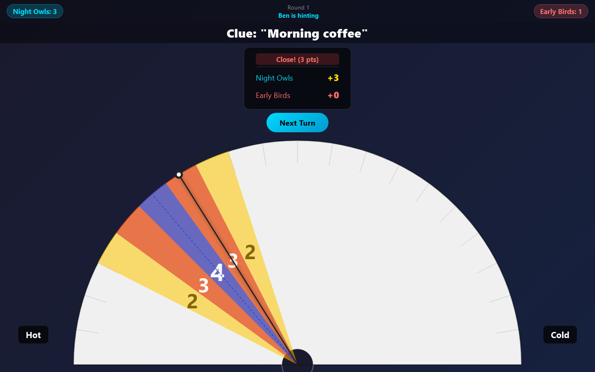
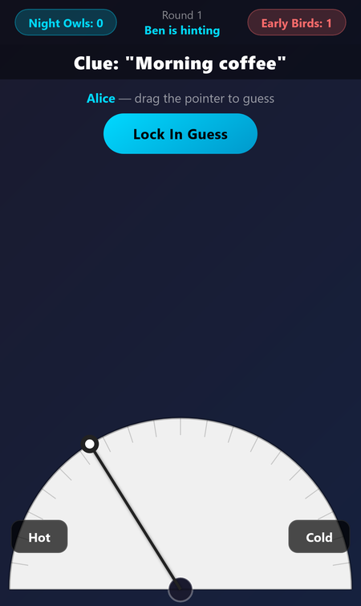
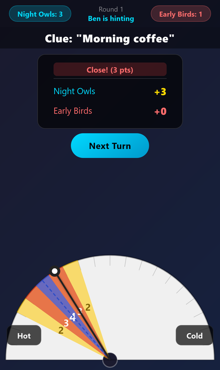

# Wavelength

A browser version of the party game Wavelength for two teams sharing one screen: one player gives a clue, their team turns the dial, and everyone finds out how close they got.

**[▶ Open the live app](https://timothyhadfield.github.io/wavelength/)** · works on phone and laptop

  
  &nbsp;
  

## Features
- **A draggable dial**: the guessing team drags the pointer (mouse or touch) along a half-circle between two opposites, like Hot and Cold.
- **Hidden target, fair turns**: a "look away" screen hands the device to the clue-giver, who is the only one to see the target before typing a clue.
- **Scoring zones**: 4 for a bullseye, 3 for close, 2 for near, shown with an animated reveal on the dial.
- **Counter-guess**: the other team calls left or right of the guess to steal a point.
- **Teams and turn order**: name the teams and players; the app rotates who gives the clue and keeps score to 8, 10, 15 or 20.
- **About 70 built-in spectrum cards**, plus your own lists you can add, pick from or remove before a game.

  

## Built with
One self-contained HTML file with plain CSS and JavaScript (the dial is drawn on a canvas), hosted on GitHub Pages.

## How to play
One player is the **psychic**. They see a hidden target somewhere on a spectrum between
two opposites, and give their team a single clue. The team then argues about where on
that spectrum the target sits and locks in a guess — the closer they land, the more
points they score. The opposing team gets a chance to guess which side of the guess the
real target fell on.

Set up your teams and player names, and the app handles turn order, the spectrum cards,
the dial and the scoring.

## Running it

A single self-contained HTML file — no build step, no dependencies. Open
[`index.html`](index.html) in a browser, or use the live link above.
